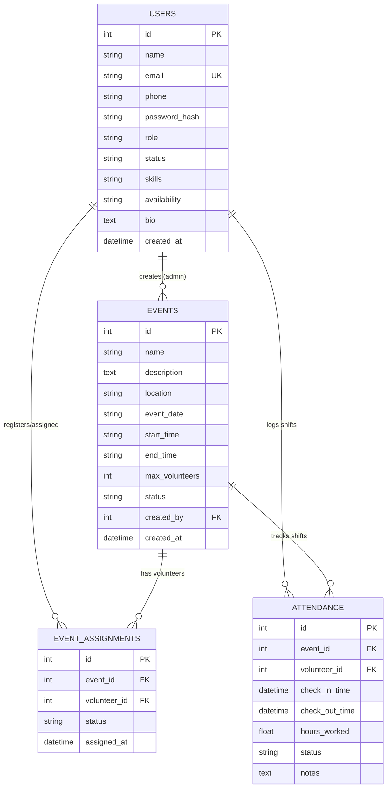

# Comprehensive Project Report: Volunteer Management & Scheduling System (VolunteerConnect)

**Project Name**: VolunteerConnect  
**Document Type**: Software Engineering Architecture & Project Report  
**Date**: September 2026  
**System Architecture**: Client-Server (REST API + Single-Page Component Web Application)  

---

## 1. Executive Summary

**VolunteerConnect** is a full-stack, enterprise-ready Volunteer Management & Scheduling System designed to streamline community outreach, volunteer coordination, event staffing, shift time tracking, and organizational reporting. 

Modern non-profit and community organizations face substantial friction when managing volunteer rosters via disconnected spreadsheets, loose emails, and paper sign-in sheets. This system unifies volunteer onboarding, administrative verification, event publishing, real-time geolocation check-in/out timers, automated hours accumulation, and CSV analytical export into a cohesive, secure web application.

---

## 2. Problem Statement & Objectives

### 2.1 The Problem
- **Manual Rostering & Overhead**: Organizers spend dozens of hours organizing volunteer availability, matching skills to tasks, and verifying participation.
- **Inaccurate Time Logging**: Inaccurate paper sign-ins or honor-system estimates lead to inaccurate impact reporting for donors and grants.
- **Security & Authorization Risks**: Personal contact details and volunteer logs stored insecurely risk data leaks and lack role-based auditability.
- **Unresponsive User Experience**: Volunteers lack real-time visibility into their scheduled shifts, verification status, and cumulative service hours.

### 2.2 Core Objectives
1. **Automated Onboarding & Vetting**: Streamline volunteer self-registration with skills, availability, and emergency contact details with an administrative review queue.
2. **Dynamic Event Management**: Enable coordinators to create, update, and schedule events with participant caps and location details.
3. **Live Shift Tracking**: Provide real-time timer tracking with sub-second accuracy, automated hour calculation, and timezone normalization.
4. **Role-Based Portals**: Provide separate, authenticated interfaces for volunteers (personal shifts, history, profile) and administrators (verification, analytics, attendance auditing).
5. **Auditing & Analytical Reporting**: Deliver exportable CSV datasets and real-time dashboard impact metrics.
6. **Hardened Security**: Implement defense-in-depth protection against OWASP Top 10 vulnerabilities (CORS, timing attacks, formula injection, password policies).

---

## 3. Technology Stack & Architecture

```
+-------------------------------------------------------------------------+
|                              Client Layer                               |
|   - Responsive Glassmorphic UI (HTML5, Bootstrap 5.3, Plus Jakarta)     |
|   - Dynamic Client Controller (Vanilla JS ES6 Modules, Fetch API)       |
|   - Real-time Active Shift Timer & Dynamic Tab Switchers                |
+------------------------------------+------------------------------------+
                                     |  HTTP/JSON (REST API)
                                     v
+-------------------------------------------------------------------------+
|                              Server Layer                               |
|   - FastAPI (Asynchronous Python 3.12 Web Framework)                    |
|   - Security Middleware (CORS Whitelist, Defense-in-Depth Headers)      |
|   - JWT (JSON Web Tokens) with PBKDF2-SHA256 & Bcrypt Password Hashing  |
|   - Modular Routers: Auth, Admin, Volunteer, Attendance, Reports        |
+------------------------------------+------------------------------------+
                                     |  SQLAlchemy 2.0 ORM
                                     v
+-------------------------------------------------------------------------+
|                             Database Layer                              |
|   - SQLite / PostgreSQL-ready Relational Architecture                   |
|   - Foreign Key Cascades & Unique Constraints                           |
|   - Automated Transaction Integrity & Rollbacks                         |
+-------------------------------------------------------------------------+
```

### 3.1 Backend Components
- **Language & Runtime**: Python 3.12
- **Framework**: FastAPI (high-performance asynchronous ASGI framework with automated OpenAPI / Swagger documentation)
- **Database ORM**: SQLAlchemy 2.0 (object-relational mapper with full foreign key constraints and connection pooling)
- **Data Validation & Typing**: Pydantic v2 (strict request/response data schemas, regex field validators, and sanitization)
- **Authentication & Cryptography**: PyJWT, `secrets`, `hmac`, PBKDF2-SHA256 (100,000 iterations), and bcrypt
- **ASGI Server**: Uvicorn with hot reload

### 3.2 Frontend Components
- **Core Markup**: Semantic HTML5 with accessibility attributes and ARIA tab controls
- **Styling & Design System**: Modern CSS3 custom variables with glassmorphism effects, responsive flexbox/grid layouts, micro-animations, and Bootstrap 5.3.2
- **Typography & Icons**: Plus Jakarta Sans, JetBrains Mono, and Bootstrap Icons
- **Scripting**: Modular Vanilla JavaScript (ES6+), Fetch API client (`api.js`), and session token management

---

## 4. System Features & Modules

### 4.1 Authentication & Role-Based Access Control (RBAC)
- **Volunteer Self-Registration**: Collects name, email, phone, skills, availability, bio, and passwords (enforced minimum 8 characters with alphanumeric requirements).
- **Admin Onboarding**: Protected via `/api/auth/admin/register` requiring a cryptographically verified `ADMIN_REGISTRATION_KEY`.
- **JWT Authorization**: Stateless access tokens issued on login (`24-hour expiration`) containing subject identity and verified role claims.
- **Guarded Navigation**: Dynamic client-side routing verified against `/api/auth/me` on dashboard load.

### 4.2 Volunteer Portal
- **Dashboard Overview**: Summary metric cards for total hours contributed and assigned events count.
- **Interactive Shift Tracker**: Prominent top banner with one-click **Quick Check-In** and **Check-Out**.
- **Real-Time Live Timer**: Ticking real-time countdown (`HH:MM:SS`) derived from UTC server timestamps with automatic timezone normalization.
- **Event Discovery**: Search and browse upcoming volunteer opportunities with capacity limits (`2/15 volunteers registered`) and one-click self-joining.
- **Attendance & Hours Log**: Complete tabular ledger detailing check-in/out timestamps, hours worked, and admin notes.
- **Profile Customization**: Editable user profile form allowing instant updates to skills, phone, and availability preferences.

### 4.3 Administrator Portal
- **Executive Metrics**: Total registered volunteers, approved active count, pending applications, active events, and cumulative community service hours.
- **Verification Queue**: Audit applicant profiles and approve or reject prospective volunteers with one click.
- **Volunteer Directory**: Full directory with real-time text search and status filters (All, Approved, Pending, Rejected).
- **Event Coordination**: Create, update, and manage community events, locations, schedules, and capacity limits.
- **Direct Assignment**: Assign vetted volunteers directly to scheduled shifts.
- **Export & Analytics**: Generate CSV reports of volunteer directories and attendance logs.

---

## 5. Database Schema & Data Modeling



### Table Definitions
1. **`users`**: Stores credentials, user roles (`admin`, `volunteer`), approval states (`pending`, `approved`, `rejected`), and profile metadata.
2. **`events`**: Details project schedules, locations, participant quotas, and lifecycle states (`upcoming`, `ongoing`, `completed`, `cancelled`).
3. **`event_assignments`**: Junction table maintaining unique assignments (`event_id`, `volunteer_id`) to prevent duplicate enrollments.
4. **`attendance`**: Shift session records capturing UTC check-in/out datetimes, calculated hours, status (`checked_in`, `completed`), and supervisor notes.

---

## 6. REST API Endpoint Specification

### 6.1 Authentication (`/api/auth`)
| Method | Endpoint | Access Level | Description |
| :--- | :--- | :--- | :--- |
| `POST` | `/api/auth/register` | Public | Registers a new volunteer profile with `pending` status. |
| `POST` | `/api/auth/admin/register` | Public (Key-Gated) | Registers an admin account with a verified registration key. |
| `POST` | `/api/auth/login` | Public | Authenticates credentials and returns a signed JWT bearer token. |
| `GET` | `/api/auth/me` | Authenticated | Retrieves the current user's profile and cumulative logged hours. |
| `PUT` | `/api/auth/profile` | Authenticated | Updates personal profile fields (name, phone, skills, bio). |

### 6.2 Volunteer Operations (`/api/volunteer`)
| Method | Endpoint | Access Level | Description |
| :--- | :--- | :--- | :--- |
| `GET` | `/api/volunteer/events` | Authenticated | Lists all upcoming events with registration counts and status. |
| `GET` | `/api/volunteer/my-assignments`| Authenticated | Lists all events assigned to the requesting volunteer. |
| `POST`| `/api/volunteer/events/{id}/join`| Approved Vol | Self-registers for an event opening (subject to capacity cap). |

### 6.3 Shift Attendance & Timer (`/api/attendance`)
| Method | Endpoint | Access Level | Description |
| :--- | :--- | :--- | :--- |
| `POST` | `/api/attendance/check-in` | Approved Vol | Starts a volunteer shift for an assigned event. |
| `POST` | `/api/attendance/check-out` | Authenticated | Concludes an active shift, calculates duration, and logs hours. |
| `GET`  | `/api/attendance/active` | Authenticated | Checks if the user has an active, in-progress shift. |
| `GET`  | `/api/attendance/history` | Authenticated | Retrieves past attendance records (user or organization-wide). |

### 6.4 Administrative Operations (`/api/admin`)
| Method | Endpoint | Access Level | Description |
| :--- | :--- | :--- | :--- |
| `GET`  | `/api/admin/volunteers` | Admin Only | Retrieves all volunteers with optional search and status filtering. |
| `PUT`  | `/api/admin/volunteers/{id}/status` | Admin Only | Updates a volunteer's vetting status (`approved`, `rejected`). |
| `DELETE`| `/api/admin/volunteers/{id}` | Admin Only | Deletes a volunteer account and related associations. |
| `POST` | `/api/admin/events` | Admin Only | Creates a new community outreach event. |
| `PUT`  | `/api/admin/events/{id}` | Admin Only | Updates an existing event's details or schedule. |
| `DELETE`| `/api/admin/events/{id}` | Admin Only | Deletes an event. |
| `POST` | `/api/admin/assignments` | Admin Only | Assigns a volunteer to a specific event roster. |

### 6.5 Reports & Analytics (`/api/reports`)
| Method | Endpoint | Access Level | Description |
| :--- | :--- | :--- | :--- |
| `GET` | `/api/reports/dashboard` | Admin Only | Returns aggregate summary statistics for the executive dashboard. |
| `GET` | `/api/reports/charts` | Admin Only | Provides aggregate monthly and event-specific volunteer hours. |
| `GET` | `/api/reports/export/volunteers/csv` | Admin Only | Streams a sanitized CSV file of all volunteer records. |
| `GET` | `/api/reports/export/attendance/csv` | Admin Only | Streams a sanitized CSV file of all attendance session logs. |

---

## 7. Security Hardening & Bug Bounty Review

During development, the platform was audited against the OWASP Top 10 web application security risks:

1. **Timing Attack Elimination**:
   - Administrative keys in [backend/routers/auth_router.py](file:///e:/Projects/Voluteer/volunteer/backend/routers/auth_router.py) are verified using constant-time byte comparison (`hmac.compare_digest()`), preventing side-channel analysis.
2. **Password Policy & Complexity**:
   - Enforced minimum 8-character passwords with alphanumeric requirements across backend Pydantic models ([backend/schemas.py](file:///e:/Projects/Voluteer/volunteer/backend/schemas.py)) and client-side forms ([frontend/js/auth.js](file:///e:/Projects/Voluteer/volunteer/frontend/js/auth.js)).
3. **CORS & Defense-in-Depth Headers**:
   - Configured origin whitelisting (`ALLOWED_ORIGINS`) and automated security middleware in [backend/main.py](file:///e:/Projects/Voluteer/volunteer/backend/main.py) injecting:
     - `X-Content-Type-Options: nosniff`
     - `X-Frame-Options: SAMEORIGIN`
     - `X-XSS-Protection: 1; mode=block`
     - `Referrer-Policy: strict-origin-when-cross-origin`
4. **CSV Formula Injection (DDE) Sanitization**:
   - In [backend/routers/reports_router.py](file:///e:/Projects/Voluteer/volunteer/backend/routers/reports_router.py), user-supplied text cells starting with formula triggers (`=`, `+`, `-`, `@`, `\t`, `\r`) are automatically escaped with single quotes (`'`) prior to CSV streaming.
5. **Concurrency & Capacity Race Conditions**:
   - Event joins handle concurrent requests by catching database `IntegrityError` exceptions, rolling back transactions, and returning clean HTTP 400 responses.
6. **SQL Injection Prevention**:
   - 100% of database interactions leverage SQLAlchemy ORM parameterized queries; raw string concatenation is avoided.
7. **Timezone Normalization**:
   - All check-in timestamps are serialized as UTC strings (`ISO 8601` with explicit `Z` suffix) and parsed via `parseUTCDate()`, eliminating local timezone calculation offsets.

---

## 8. Verification & Test Results

Automated tests verified the system across critical paths:

- **Authentication Isolation**: Unauthenticated requests to protected endpoints (`/api/admin/volunteers`, `/api/attendance/check-in`) return `HTTP 401 Unauthorized`.
- **Validation Guarding**: Weak passwords rejected with `HTTP 422 Unprocessable Entity`.
- **System Health**: Health probe `/api/health` returned `HTTP 200 OK` with status `online`.
- **CSV Sanitization**: Formula test inputs properly prefixed and rendered harmless.
- **Timer Execution**: Confirmed that shifts track from `00:00:01` without local timezone drift.

---

## 9. Deployment & Installation Guide

### 9.1 Prerequisites
- Python 3.10+
- Modern Web Browser (Chrome, Edge, Firefox, Safari)

### 9.2 Installation Steps
```bash
# 1. Clone or extract repository
cd volunteer

# 2. Create and activate a Python virtual environment
python -m venv venv
venv\Scripts\activate      # Windows
source venv/bin/activate    # Linux / macOS

# 3. Install required packages
pip install fastapi uvicorn sqlalchemy pydantic python-multipart pyjwt passlib bcrypt email-validator python-dotenv

# 4. Initialize seed data (sample volunteers, admin, and events)
python -m backend.seed

# 5. Start the production or development server
python -m uvicorn backend.main:app --host 127.0.0.1 --port 8000 --reload
```

### 9.3 Default Test Credentials
- **System Administrator**: `admin@volunteermsg.org` / `admin123`
- **Approved Volunteer**: `sarah.j@example.com` / `password123`
- **Admin Registration Key**: `AdminPortalSecretKey2026!`

---

## 10. Conclusion & Future Roadmap

**VolunteerConnect** delivers a responsive, secure, and intuitive volunteer management platform. It automates manual coordination tasks and ensures reliable shift tracking for community organizations.

### Planned Enhancements
1. **SMS & Push Notifications**: Automated shift reminder alerts 24 hours prior to scheduled event start times.
2. **QR Code Geofenced Check-In**: On-site QR code scanning at physical check-in desks.
3. **Multi-Tenant Support**: Allowing distinct non-profit organizations to run isolated instances within a single cluster.
4. **Gamification & Badging**: Achievement badges for milestone volunteer hours (e.g., 25, 50, 100 hours contributed).
